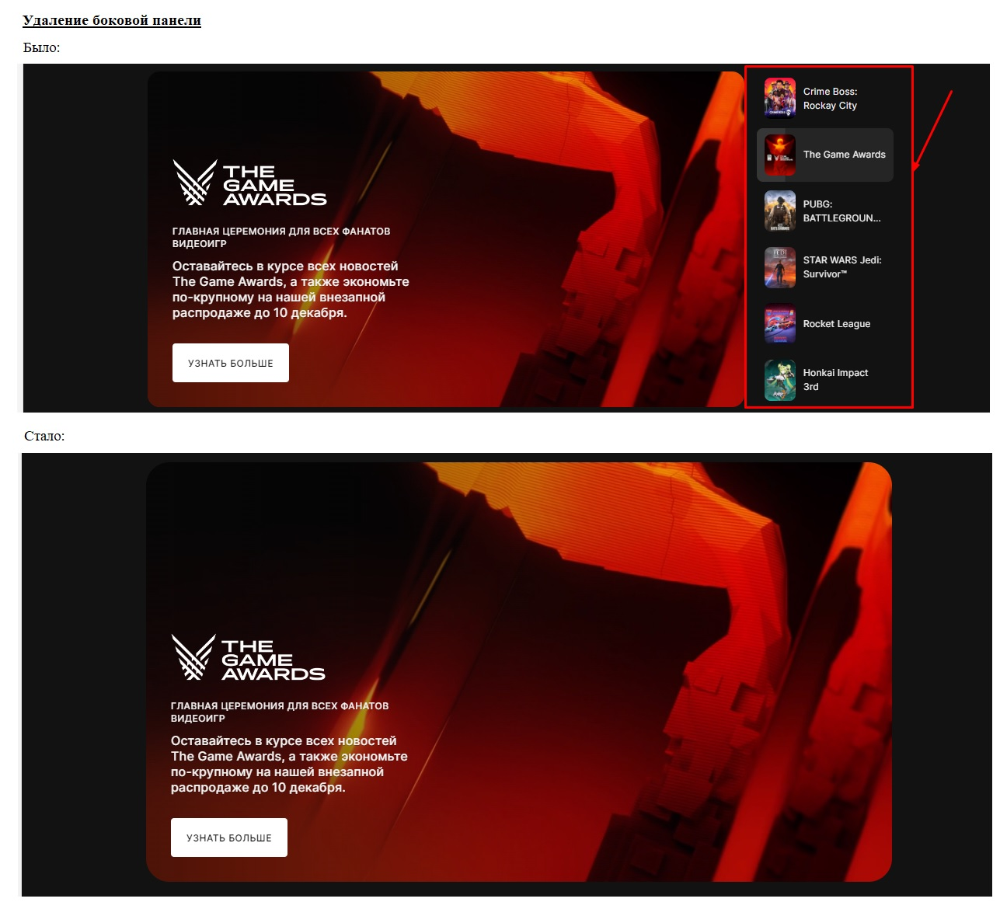

# Знакомство с веб-технологиями (семинары)

## Урок 1. Веб-технологии: вчера, сегодня, завтра

<u>***Задача***</u>

На основе сайта https://store.epicgames.com/ru/ либо любого другого на ваш выбор:

- Определите, на каком протоколе работает сайт.
- Проанализируйте структуру страницы сайта.
- Внесите не менее 10 изменений на страницу с помощью инструмента разработчика и представьте скриншоты было/стало.
- Создайте прототип низкой детализации (дополнительное задание, если на семинаре дошли до задания №8).

Сдавайте задания скриншотами png или jpg и комментарием, можете ссылкой на GitHab.

---

### <u>*1. Определите, на каком протоколе работает сайт:*</u>

:point_right: [Протокол](https://github.com/ANT050/Introduction_to_web_technologies/blob/main/pictures/protocol.jpg "Открыть")

---

### <u>*2. Проанализируйте структуру страницы сайта:*</u>

:point_right: [Структура страницы сайта](https://github.com/ANT050/Introduction_to_web_technologies/blob/main/pictures/page_structure.jpg "Открыть")

---

### <u>*3. Внесите не менее 10 изменений на страницу с помощью инструмента разработчика и представьте скриншоты было/стало.:*</u>

1. 

:point_right: [Изменение заголовка страницы](https://github.com/ANT050/Introduction_to_web_technologies/blob/main/pictures/1_heading.jpg "Открыть")

---

2. 

:point_right: [Изменение картинок](https://github.com/ANT050/Introduction_to_web_technologies/blob/main/pictures/2_pictures.jpg "Открыть")

---

3. 

:point_right: [Изменение фона](https://github.com/ANT050/Introduction_to_web_technologies/blob/main/pictures/3_background.jpg "Открыть")

---

4. 

:point_right: [Изменение длины поля поиска](https://github.com/ANT050/Introduction_to_web_technologies/blob/main/pictures/4_search_field.jpg "Открыть")

---

5. 

:point_right: [Изменение меню](https://github.com/ANT050/Introduction_to_web_technologies/blob/main/pictures/5_menu.jpg "Открыть")

---

6. 

:point_right: [Изменение кнопок](https://github.com/ANT050/Introduction_to_web_technologies/blob/main/pictures/6_buttons.jpg "Открыть")

---

7. 

:point_right: [Удаление надписи](https://github.com/ANT050/Introduction_to_web_technologies/blob/main/pictures/7_record.jpg "Открыть")

---

8. 

:point_right: [Изменение цвета кнопки "Вход"](https://github.com/ANT050/Introduction_to_web_technologies/blob/main/pictures/8_button.jpg "Открыть")

---

9. 

:point_right: [Удаление боковой панели](https://github.com/ANT050/Introduction_to_web_technologies/blob/main/pictures/9_Removing_the_sidebar.jpg "Открыть")

---

10. 

:point_right: [Удаление header(шапки)](https://github.com/ANT050/Introduction_to_web_technologies/blob/main/pictures/10_Removing_the_header.jpg "Открыть")

---
